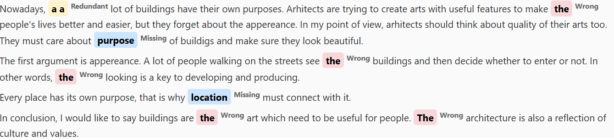

 

# Grammarticle 


**GrammArticle** is a roberta-based grammar checker for English article usage.  
The model classifies **three types of article errors**:

1. **Missing** – when an article is absent but required  
2. **Wrong** – when an incorrect article is used (e.g., "a apple" instead of "an apple", "the" instead of "a/an")  
3. **Redundant** – when an article is unnecessary (e.g., "the furniture")



___

## Installation

GrammArticle is trained on publicly available grammatical error correction (GEC) datasets with synthetic augmentation and is available as a SpaCy pipeline.


```bash
pip install spacy-transformers
python -m spacy download en_core_web_trf
pip install https://huggingface.co/iproskurina/en_grammarticle/resolve/main/en_grammarticle-1-py3-none-any.whl

```

## Usage

```
import spacy
import en_grammarticle
nlp = en_grammarticle.load()
text = "Some text"
doc = nlp(text)
for span in doc.spans.get("sc", []): 
    print(f"[{span.label_}] {span.text}")
```


